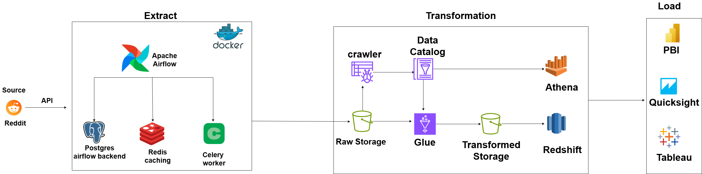

# Reddit Data Engineering Project

This project automates the extraction of data from Reddit, transforms it, and loads it into Amazon S3 and, optionally, downstream analytical tools such as AWS Glue, Redshift, and Athena. The overall goal is to showcase a modern data pipeline using **Apache Airflow**, **Docker**, **AWS services**, and **Python**.

---

## Table of Contents

1. [Architecture Overview](#architecture-overview)  
2. [Project Structure](#project-structure)  
3. [Prerequisites](#prerequisites)  
4. [Setup Instructions](#setup-instructions)   
5. [AWS Integration](#aws-integration)  
6. [License](#license)  

---

## Architecture Overview



The diagram above illustrates the end-to-end flow:

1. **Extract**  
   - **Reddit** is the data source (via Reddit’s API).  
   - **Apache Airflow** orchestrates tasks.  
   - **Postgres** (Airflow backend) and **Redis** (caching) are used by Airflow and Celery workers.  
   - **Docker** containers manage the environment.

2. **Transformation**  
   - Data is stored in S3 (raw zone).  
   - An AWS Glue Crawler updates a **Data Catalog**.  
   - AWS Glue (or custom ETL scripts) transforms the data and outputs it to a transformed S3 bucket.  
   - Optionally, the data can be loaded into **Amazon Redshift** for further analytics.

3. **Load**  
   - Data can be queried via **Amazon Athena** or Redshift.  
   - **Power BI**, **Quicksight**, or **Tableau** can connect to Athena/Redshift for visualization.

---

## Project Structure

Below is a brief description of the folders and files in this repository:

```
.
├── Architecture/
│   └── architecture.png           # Architecture diagram (placeholder name)
├── aws_transformation/
│   └── aws_transformation.py                       # AWS Glue scripts, transformation code
├── config/
│   └── config.conf                       # Config files, placeholders for environment variables, etc.
├── dags/
│   └── reddit_dag.py             # Airflow DAG definition for Reddit pipeline
├── data/
│   └── output/                    # CSV/JSON output files from local runs
├── etls/
│   └── reddit_etl.py             # Core extraction & transformation logic for Reddit
│   └── aws_etl.py                # AWS S3 connection & utility functions
├── pipelines/
│   └── reddit_pipeline.py         # Orchestration code for the Reddit pipeline
│   └── aws_s3_pipeline.py         # Orchestration code for uploading data to S3
├── utils/
│   └── constants.py               # Constants (e.g., AWS bucket name, file paths, etc.)
├── airflow.env                    # Environment variables for Airflow
├── docker-compose.yml             # Docker Compose file to spin up Airflow, Postgres, Redis, etc.
├── dockerfile                     # Dockerfile for building a custom image
├── requirements.txt               # Python dependencies
└── README.md                      # This file
```

---

## Prerequisites

1. **Docker** and **Docker Compose** installed.  
2. **Python 3.8+** (if you want to run scripts locally instead of Docker).  
3. **AWS Account** (if you plan to use S3, Glue, Redshift, etc.).  
4. **Reddit API Credentials** (client ID and secret).  

---

## Setup Instructions

1. **Clone the Repository**  
   ```bash
   git clone https://github.com/MOdiaa2003/Reddit_pipline.git
   cd reddit-data-engineering
   ```

2. **Configure Environment Variables**  
   - Create or update the `airflow.env` file with the necessary environment variables:
     ```ini
     AIRFLOW__CORE__EXECUTOR=CeleryExecutor
     REDDIT_CLIENT_ID=<YOUR_REDDIT_CLIENT_ID>
     REDDIT_SECRET=<YOUR_REDDIT_SECRET>
     AWS_ACCESS_KEY_ID=<YOUR_AWS_ACCESS_KEY_ID>
     AWS_SECRET_ACCESS_KEY=<YOUR_AWS_SECRET_ACCESS_KEY>
     AWS_REGION=<YOUR_AWS_REGION>
     AWS_BUCKET_NAME=<YOUR_S3_BUCKET_NAME>
     ```
   - You can also set these variables in your system environment if preferred.

3. **Install Dependencies (if running locally)**  
   ```bash
   pip install -r requirements.txt
   ```

4. **Start Docker Containers**  
   - To run Airflow, Postgres, Redis, and Celery workers:
     ```bash
     docker-compose up -d
     ```
   - This will spin up all services needed for Airflow to orchestrate the pipeline.

5. **Access Airflow**  
   - Once containers are up, navigate to `http://localhost:8080` (or the mapped port in your Docker Compose file) and log in using the default credentials specified in the `docker-compose.yml` (often `airflow` / `airflow`).


## AWS Integration

After data lands in S3, you can automate further transformations with:
- **AWS Glue**: A crawler to catalog the raw data and ETL scripts to transform it into a curated schema.  
- **Amazon Redshift**: Load transformed data into a warehouse for complex queries.  
- **Amazon Athena**: Query data in S3 directly using standard SQL.  
- **BI Tools**: Connect Athena/Redshift to **Power BI**, **Quicksight**, or **Tableau** for interactive dashboards.


## License

This project is licensed under the [MIT License](LICENSE). Feel free to use and modify it according to your needs.

---

**Happy Data Engineering!** If you have any questions or run into any issues, feel free to open an issue or reach out.
